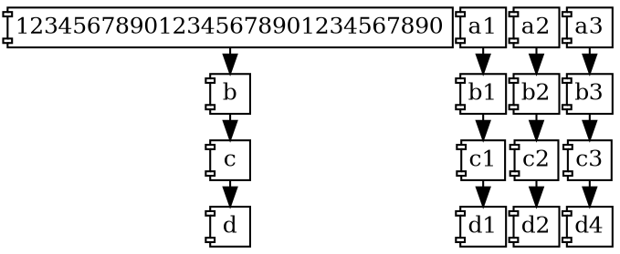
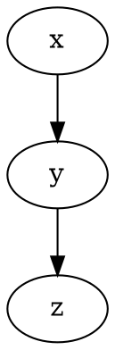

\newpage
### topico1




\newpage
### topico2




\newpage
### MS SQL

```java
public class SomeTest {

    @Rule
    public MSSQLServerContainer mssqlserver = new MSSQLServerContainer()
        .acceptLicense();

    @Test
    public void someTestMethod() {
        String url = mssqlserver.getJdbcUrl();

```

```xml
<dependency>
    <groupId>org.testcontainers</groupId>
    <artifactId>mssqlserver</artifactId>
    <version>1.14.3</version>
    <scope>test</scope>
</dependency>
```